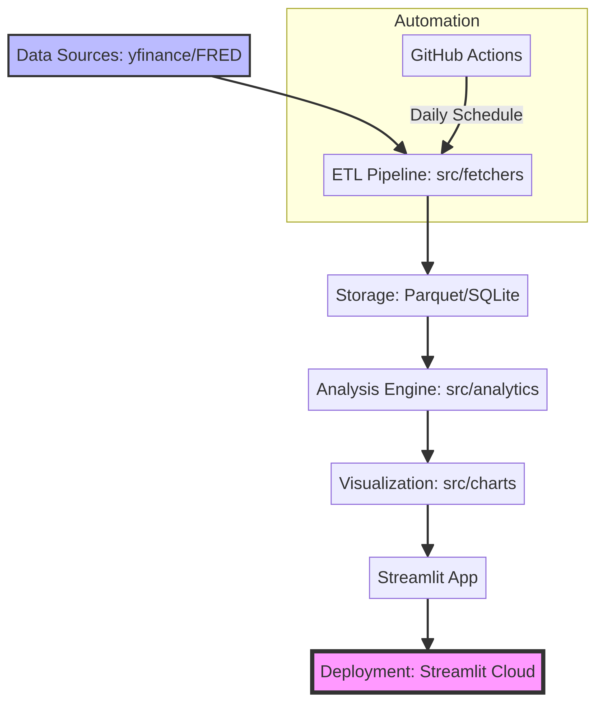

# 📊 市場情報平台 (Market Intelligence Platform)

## 專案簡介

這是一個為個人學習和決策支持而設計的市場情報儀表板。它能夠自動提取實時市場數據（股票指數、外匯、黃金和收益率曲線），生成互動式圖表，並提供簡潔的每日/每週摘要。該平台旨在展示數據工程、金融分析、互動式可視化和自動化報告生成等端到端技能。

## 🚀 履歷亮點

*   **真實的金融數據管道：** 整合 `yfinance` 和 `fredapi`，構建穩健的數據採集與處理流程，處理多種金融資產數據。
*   **互動式視覺化：** 採用 `Plotly` 和 `Streamlit` 創建高度可定制和互動的金融圖表，提升用戶體驗，支持多維度數據探索。
*   **自動化分析與報告：** 實現每日/每週市場概覽的自動生成，結合基於規則的摘要引擎與 LLM 深度評述，將數據轉化為有價值的市場洞察。
*   **模組化與可擴展架構：** 遵循最佳實踐，設計清晰的模組化 Python 程式碼庫，易於維護和功能擴展。
*   **雲端部署經驗：** 透過 `Streamlit Cloud` 快速部署，提供可訪問的線上展示平台，展現實際部署能力。

## ✨ 核心功能

### 數據採集
*   **股票指數：** S&P 500, NASDAQ Composite, Hang Seng Index, FTSE 100, Nikkei 225
*   **外匯貨幣對：** EUR/USD, USD/JPY, GBP/USD, USD/CNH
*   **大宗商品：** 黃金期貨
*   **美國國債收益率曲線：** 2年期、5年期、10年期、30年期收益率

### 數據分析
*   **金融指標：** 日回報率、累計回報、滾動波動率、最大回撤。
*   **收益率曲線分析：** 10Y-2Y, 10Y-5Y 利差計算，曲線形狀（正常、平坦、倒掛）識別。
*   **資產相關性：** 計算資產間的滾動相關性，揭示市場聯動性。

### 互動式儀表板 (Streamlit)
*   **概覽頁：** 顯示核心市場指標和宏觀環境摘要。
*   **資產分析頁：** 提供各類資產的歷史價格圖、統計指標，支持日期範圍和資產選擇。
*   **宏觀視圖頁：** 展示當前及歷史收益率曲線、利差監測圖和資產相關性熱圖。

### 自動化與報告
*   **每日數據更新：** 自動從數據源獲取最新數據並處理。
*   **市場摘要生成：** 基於規則自動生成市場亮點，並集成 LLM 進行深度市場評述。
*   **Markdown 報告導出：** 自動生成每日市場報告，方便查閱和分享。

## 🛠️ 技術棧

*   **Python 語言：** 核心開發語言。
*   **數據獲取：** `yfinance`, `fredapi`。
*   **數據處理：** `pandas`, `numpy`。
*   **視覺化：** `plotly`, `plotly.express`。
*   **儀表板：** `Streamlit`。
*   **自動化：** `GitHub Actions` (用於生產環境調度), `python-dotenv`。
*   **儲存：** `Parquet` 文件 (高效時間序列數據存儲)。
*   **報告生成：** `Jinja2`, `Markdown`。
*   **部署：** `Streamlit Community Cloud`。
*   **日誌：** `logging` 模組。

## 🏗️ 專案架構

以下是本市場情報平台的數據流和模組化架構圖：



## 📂 資料夾結構

```
market-intelligence/
├── data/                 # 原始資料與處理後的數據
│   ├── raw/              # 原始下載的數據 (e.g., CSV, Parquet)
│   └── processed/        # 經過清洗、計算後的數據
├── src/
│   ├── fetchers/         # 數據獲取模組 (yfinance, FRED API)
│   ├── processors/       # 數據清洗、轉換、特徵工程模組
│   ├── analytics/        # 金融分析邏輯 (收益率曲線、市場機制、統計計算)
│   ├── charts/           # Plotly 圖表生成函數庫
│   ├── summaries/        # 文本摘要生成邏輯 (基於規則或 LLM)
│   └── utils/            # 通用工具函數 (如日誌)
├── app/                  # Streamlit 儀表板應用程式
│   ├── pages/            # Streamlit 多頁面應用文件
│   ├── main.py           # Streamlit 主入口文件 (概覽頁)
│   └── utils.py          # Streamlit 應用工具函數 (如數據加載、緩存)
├── reports/              # 產生的 PDF / Markdown 報告
├── config/               # 觀察清單、API 金鑰、應用配置 (YAML/JSON)
├── notebooks/            # 數據探索、模型驗證的 Jupyter Notebooks
├── tests/                # 單元測試與集成測試
├── .env                  # 環境變量配置 (API keys)
├── requirements.txt      # Python 依賴包列表
├── README.md             # 專案說明文件
├── .gitignore            # Git 忽略文件配置
├── run_dashboard.sh      # 啟動 Streamlit 儀表板的腳本
└── run_daily_update.py   # 每日數據更新與報告生成腳本
```

## ⚙️ 安裝與運行

### 1. 克隆倉庫

```bash
git clone <您的 GitHub 倉庫地址>
cd market-intelligence
```

### 2. 建立虛擬環境並安裝依賴

```bash
python3 -m venv venv
source venv/bin/activate  # macOS/Linux
# venv\Scripts\activate   # Windows
pip install -r requirements.txt
```

### 3. 配置 API Key

*   前往 [FRED 官網](https://fred.stlouisfed.org/docs/api/api_key.html) 申請免費 API Key。
*   在專案根目錄創建 `.env` 文件，並添加您的 FRED API Key：
    ```
    FRED_API_KEY=你的FRED_API_KEY
    # (可選) 若需 AI 評述功能，請添加 xAI 或 OpenAI Key
    XAI_API_KEY=你的XAI_API_KEY
    # 或者
    OPENAI_API_KEY=你的OPENAI_API_KEY
    ```

### 4. 數據採集與處理

首次運行或需要更新數據時，執行：

```bash
python run_daily_update.py
```
這將會從 `yfinance` 和 `FRED` 獲取最新數據，計算所有指標，並生成一份市場報告。

### 5. 啟動儀表板

```bash
./run_dashboard.sh
```

或直接運行：

```bash
streamlit run app/main.py
```

您的市場情報儀表板將在瀏覽器中打開 (通常是 `http://localhost:8501`)。

## ☁️ 部署到 Streamlit Community Cloud

1.  將您的專案推送到 GitHub 倉庫。
2.  訪問 [Streamlit Community Cloud](https://share.streamlit.io/)。
3.  點擊 "New app"，選擇您的 GitHub 倉庫和 `app/main.py` 作為主文件。
4.  確保 `requirements.txt` 和 `.env` 文件（或在 Streamlit Secrets 中配置 FRED_API_KEY）已正確設置。
5.  點擊 "Deploy!"，您的儀表板將會自動部署並生成一個公開鏈接。

## 🤝 貢獻

歡迎提出問題、建議或貢獻代碼。請通過 GitHub Issues 或 Pull Requests 進行。

## 📄 許可證

此專案根據 MIT 許可證發布。
