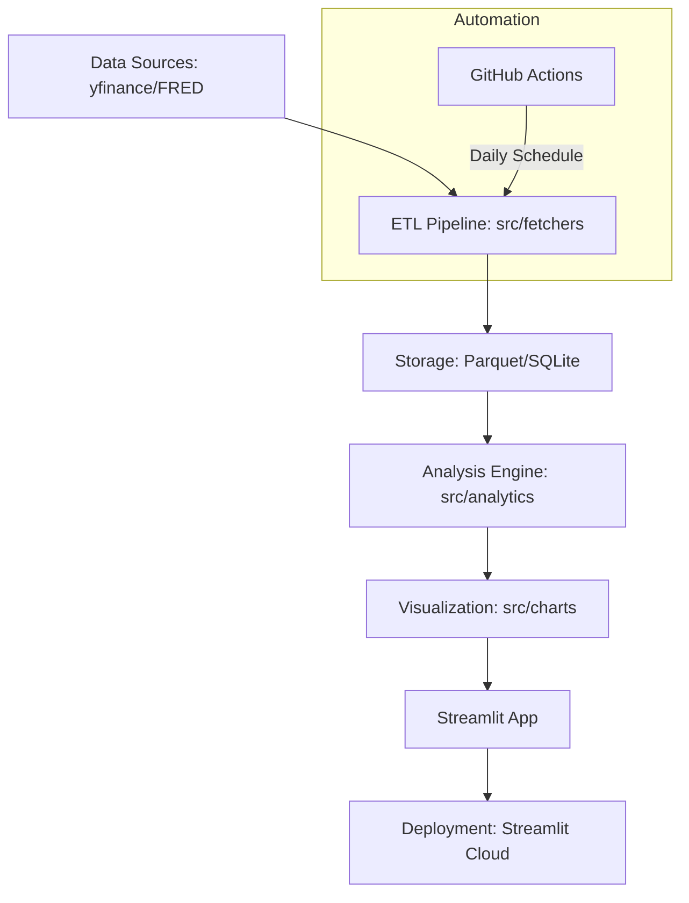

# 市場情報平台 (Market Intelligence Platform) - 專案實施計劃

這份計劃旨在指導您建立一個專業級別的金融數據可視化平台。該項目不僅能作為個人學習工具，更能作為展現您**數據工程**、**金融分析**與**全棧開發思維**的履歷亮點。

---

## 1. 專案願景與履歷定位 (Project Vision & Resume Positioning)

**專案願景：**
建立一個個人市場情報儀表板，能夠自動提取實時市場數據（股票指數、外匯、黃金和收益率曲線），生成互動式圖表，並提供簡潔的每日/每週摘要，用於自我學習和決策支持。

**履歷關鍵描述：**
> 「開發了一個自動化市場情報儀表板，整合多源金融數據（yfinance, FRED），實現了實時資產追蹤、動態收益率曲線分析及市場機制偵測，為個人投資決策提供數據支持。」

**主要賣點：**
*   **真實的金融數據管道：** 整合 `yfinance` 和 `fredapi`，構建穩健的數據採集與處理流程。
*   **互動式視覺化：** 採用 `Plotly` 創建高度可定制和互動的金融圖表，提升用戶體驗。
*   **自動產生報告：** 實現每日/每週市場概覽的自動生成，支持文本與關鍵統計數據輸出。
*   **簡潔、模組化的 Python 程式碼庫：** 遵循最佳實踐，設計清晰的模組化結構，易於維護和擴展。
*   **已部署的 Web 應用：** 透過 `Streamlit Cloud` 快速部署，提供可訪問的線上展示平台。

**技術標籤：**
*   **語言：** Python (Pandas, NumPy, Plotly)
*   **數據工程：** ETL Pipeline, FRED API, yfinance, Parquet Storage
*   **前端/部署：** Streamlit, GitHub Actions, Streamlit Cloud
*   **金融知識：** 收益率曲線 (Yield Curve), 市場機制 (Market Regimes), 滾動相關性 (Rolling Correlation)

---

## 2. 核心功能模塊 (Core Functionality Modules)

### A. 數據採集層 (Data Ingestion Layer)

該層負責從多個免費且可靠的數據源獲取金融市場數據，並進行初步的清洗與標準化。

| 數據類別 | 數據源 | 涵蓋範圍 | 備註 |
| :------- | :----- | :------- | :--- |
| **股票指數** | `yfinance` | 標普 500 (SPY)、納斯達克 100 (QQQ)、恆生指數 (HSI)、富時 100 (FTSE)、日經 225 (N225) | 提供歷史股價、交易量等數據 [1] |
| **外匯貨幣對** | `yfinance` | 歐元兌美元 (EURUSD=X)、美元/日圓 (JPY=X)、英鎊兌美元 (GBPUSD=X)、美元/離岸人民幣 (CNH=X) | 提供實時及歷史匯率數據 [1] |
| **黃金** | `yfinance` | 黃金現貨兌美元 (GC=F) | 提供黃金期貨價格數據 [1] |
| **美國公債收益率曲線** | `fredapi` | 2年期、5年期、10年期、30年期國債收益率 | 美國聯邦儲備銀行經濟數據庫 (FRED) 提供官方數據 [2] |

**穩健性設計：**
*   **數據緩存：** 採用 Parquet 或 CSV 格式本地存儲歷史數據，減少重複 API 調用。
*   **錯誤處理：** 實施 `try-except` 塊處理 API 調用失敗，並記錄錯誤日誌。
*   **速率限制：** 遵守數據源的 API 調用限制，避免 IP 封鎖。

### B. 分析引擎 (Analytics Engine)

此層對原始數據進行加工，提取有價值的金融指標和洞察。

*   **收益率曲線分析：**
    *   **利差計算：** 計算關鍵利差，如 10 年期與 2 年期國債利差 (10Y-2Y Spread)，用於判斷經濟衰退預期 [3]。
    *   **曲線形狀指標：** 監測收益率曲線的平坦化、陡峭化和倒掛現象，這些是重要的宏觀經濟信號。
*   **市場機制偵測 (Market Regime Detection)：**
    *   **基於規則：** 實施簡單規則，例如：當 VIX 指數高於某閾值或短期移動平均線跌破長期移動平均線時，標記為「避險 (Risk-off)」模式 [4]。
    *   **波動率分析：** 計算資產的滾動波動率，評估市場風險水平。
*   **統計指標：**
    *   **資產回報與波動率：** 計算每日/每週回報率、標準差。
    *   **滾動相關性：** 分析不同資產類別（如黃金與實際收益率、美元與收益率）之間的滾動相關性，揭示市場聯動性變化。

### C. 可視化儀表板 (Visualization Dashboard)

使用 `Streamlit` 構建互動式 Web 應用，並利用 `Plotly` 渲染豐富的金融圖表。

*   **互動式圖表：**
    *   **價格/K 線圖：** 展示資產的歷史價格走勢，支持日期範圍選擇。
    *   **多資產表現比較：** 在同一圖表中比較多個指數或貨幣對的表現。
    *   **滾動相關性熱圖：** 直觀展示資產間相關性的動態變化。
    *   **動畫/歷史收益率曲線：** 展現收益率曲線隨時間的演變，提供宏觀視角。
    *   **黃金與實質收益率比較：** 分析黃金價格與實際利率的關係。
*   **多頁面應用：**
    *   **概覽頁：** 匯總關鍵市場指標和每日/每週市場摘要。
    *   **資產詳情頁：** 為每個資產類別（指數、外匯、黃金、收益率曲線）提供專屬的分析和圖表。
    *   **宏觀視圖頁：** 專注於收益率曲線、市場機制和資產相關性分析。
*   **用戶交互：** 提供日期範圍選擇器、資產切換按鈕、數據刷新按鈕，增強用戶體驗。

### D. 自動化報告生成 (Automated Reporting)

實現定期的市場概覽報告生成，支持多種輸出格式。

*   **每日/每週市場概覽：**
    *   **基於規則的摘要引擎：** 自動識別並總結市場熱點，如最大波動資產、收益率曲線變化、黃金走勢等。
    *   **可選的 LLM 潤色：** 透過整合大型語言模型 (LLM) API（如 OpenAI 或本地模型），對生成的文本摘要進行自然語言潤色，使其更具可讀性和洞察力。
*   **報告格式：** 支持導出為 Markdown 或 PDF 格式，便於分享和存檔。

---

## 3. 技術棧 (Recommended Technology Stack)

本專案將完全基於 Python 生態系統構建，確保技術棧的統一性和開發效率。

| 層級 | 推薦技術 | 原因與優勢 |
| :--- | :------- | :--------- |
| **數據獲取** | `yfinance`, `fredapi` | 免費、可靠，提供豐富的金融數據，易於集成 [1] [2]。 |
| **數據處理** | `pandas`, `numpy` | Python 數據分析的標準庫，提供高效的數據結構和操作工具。 |
| **視覺化** | `plotly`, `plotly.express` | 生成互動式、美觀的圖表，與 Streamlit 完美兼容，支持 Web 應用展示。 |
| **儀表板** | `Streamlit` | 快速構建可共享的 Web 應用程式，極大地簡化前端開發。 |
| **調度** | `schedule`, `GitHub Actions` | `schedule` 適用於本地定時任務，`GitHub Actions` 提供雲端自動化數據刷新和報告生成。 |
| **儲存** | `Parquet` 文件, `SQLite` | `Parquet` 適用於高效存儲和讀取時間序列數據；`SQLite` 可用於存儲配置或少量結構化數據。 |
| **報告生成** | `Jinja2`, `Markdown`, `WeasyPrint`/`PDF` | `Jinja2` 用於模板化文本報告，`Markdown` 簡潔易讀，`WeasyPrint` 或其他 PDF 庫用於生成專業 PDF 報告。 |
| **部署** | `Streamlit Community Cloud` | 提供免費、便捷的一鍵部署服務，快速將項目上線。 |

**可選進階技術 (Full-Stack 展示)：**
若需展示更全面的全棧開發能力，可考慮引入 `FastAPI` 作為後端 API 服務，搭配 `React` 或 `Vue.js` 作為前端框架，實現更複雜的交互邏輯和用戶界面。

---

## 4. 高層架構 (High-Level Architecture)

本平台採用模組化設計，將數據流和功能邏輯清晰分離，便於開發、測試和維護。



**建議的資料夾結構：**

```
market-intelligence/
├── data/                 # 原始資料與處理後的數據
│   ├── raw/              # 原始下載的數據 (e.g., CSV, Parquet)
│   └── processed/        # 經過清洗、計算後的數據
├── src/
│   ├── fetchers/         # 數據獲取模組 (yfinance, FRED API)
│   ├── processors/       # 數據清洗、轉換、特徵工程模組
│   ├── analytics/        # 金融分析邏輯 (收益率曲線、市場機制、統計計算)
│   ├── charts/           # Plotly 圖表生成函數庫
│   └── summaries/        # 文本摘要生成邏輯 (基於規則或 LLM)
├── app/                  # Streamlit 儀表板應用程式
│   ├── pages/            # Streamlit 多頁面應用文件
│   └── main.py           # Streamlit 主入口文件
├── reports/              # 產生的 PDF / Markdown 報告
├── config/               # 觀察清單、API 金鑰、應用配置 (YAML/JSON)
├── notebooks/            # 數據探索、模型驗證的 Jupyter Notebooks
├── tests/                # 單元測試與集成測試
├── .env                  # 環境變量配置 (API keys)
├── requirements.txt      # Python 依賴包列表
├── README.md             # 專案說明文件
└── .gitignore            # Git 忽略文件配置
```

---

## 5. 實施路線圖 (6 週計劃)

以下是一個為期 6 週的實施路線圖，旨在平衡功能實現與項目質量，確保在有限時間內完成一個高質量的 MVP。

| 週次 | 目標 | 關鍵產出 | 備註 |
| :--- | :--- | :------- | :--- |
| **Week 1** | **基礎環境搭建與數據獲取** | 完成 `DataFetcher` 類，成功下載歷史數據並存儲為 Parquet 格式。 | 設置 Git 倉庫、虛擬環境、`requirements.txt`。定義 `config/watchlist.yaml`。 |
| **Week 2** | **核心金融邏輯開發** | 實現收益率曲線計算邏輯 (利差、形狀指標) 與基礎統計指標 (回報、波動率)。 | 專注於 `src/processors` 和 `src/analytics` 模組的開發。 |
| **Week 3** | **可視化原型與儀表板** | 完成 Plotly 圖表模板，建立 Streamlit 多頁面應用程式的基礎框架。 | 實現價格圖、表現比較圖、滾動相關性熱圖。 |
| **Week 4** | **市場機制與自動摘要** | 加入簡單的基於規則的市場機制標籤，並開發自動摘要邏輯。 | 探索 LLM 整合的可行性，生成初步的文本摘要。 |
| **Week 5** | **自動化與性能優化** | 配置 GitHub Actions 實現每日數據自動更新和報告生成，優化 Streamlit 應用性能。 | 實施 Streamlit 緩存機制，提升儀表板響應速度 [5]。 |
| **Week 6** | **部署與文檔完善** | 部署至 Streamlit Cloud，撰寫專業的 README.md，並添加單元測試。 | 確保項目可運行、可展示，並具備良好的文檔和測試覆蓋。 |

---

## 6. 參考資料 (References)

[1] `yfinance` 官方文檔. (n.d.). Retrieved from [https://pypi.org/project/yfinance/](https://pypi.org/project/yfinance/)
[2] `fredapi` 官方文檔. (n.d.). Retrieved from [https://pypi.org/project/fredapi/](https://pypi.org/project/fredapi/)
[3] Federal Reserve Bank of Cleveland. (n.d.). *Yield Curve as a Leading Indicator*. Retrieved from [https://www.clevelandfed.org/our-research/indicators-and-data/yield-curve](https://www.clevelandfed.org/our-research/indicators-and-data/yield-curve)
[4] Medium. (2026, May 30). *Hybrid Machine Learning for Market Regime Detection Part 2*. Retrieved from [https://medium.com/@alexzap922/hybrid-machine-learning-for-market-regime-detection-part-2-vti-iwo-jnk-agg-volatility-vxx-9b0c7a0bf0f2](https://medium.com/@alexzap922/hybrid-machine-learning-for-market-regime-detection-part-2-vti-iwo-jnk-agg-volatility-vxx-9b0c7a0bf0f2)
[5] Streamlit Docs. (n.d.). *Caching overview*. Retrieved from [https://docs.streamlit.io/develop/concepts/architecture/caching](https://docs.streamlit.com/develop/concepts/architecture/caching)
